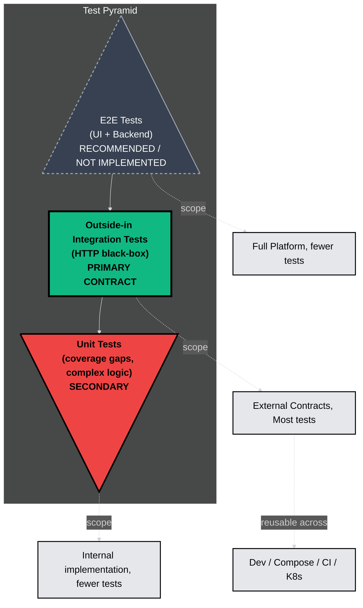
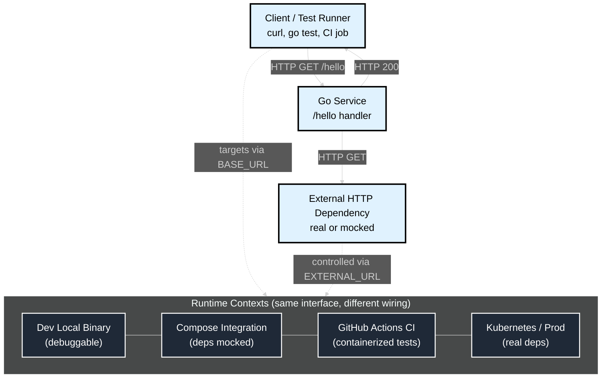
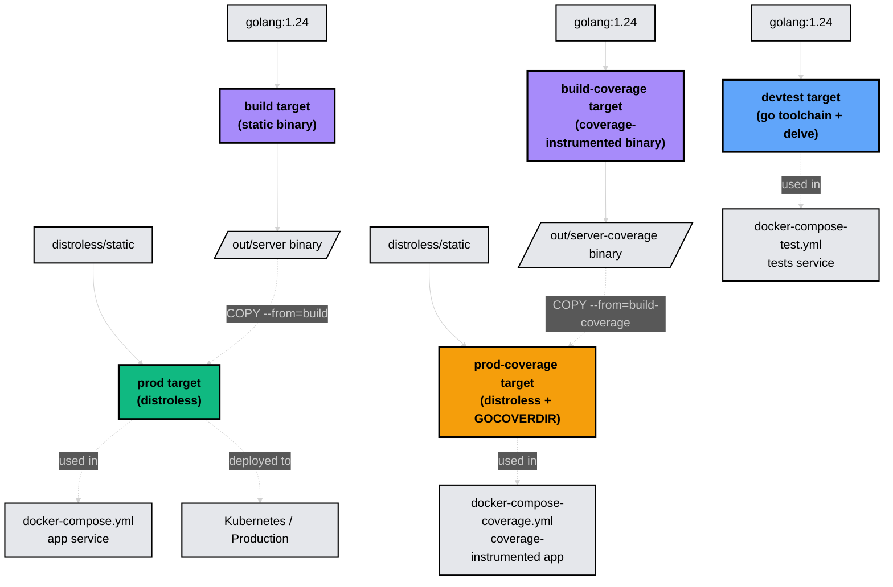
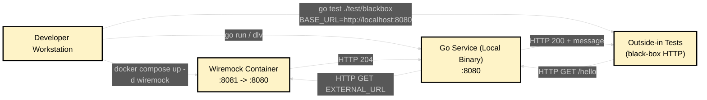

# Architecture Diagrams

This document visualizes the **outside-in testing strategy** across the main runtime contexts (local dev, Docker Compose integration, CI in GitHub Actions, and Kubernetes/prod).

All Mermaid diagrams below use a consistent high-contrast style and a larger font for readability in both light and dark mode.

---

## 1) Testing philosophy and pyramid



- **Outside-in Integration tests are primary**: They validate the stable HTTP contract and are reusable across all environments.
- **Unit tests are secondary**: Used sparingly for coverage gaps and complex internal logic, not for trivial glue code.
- **E2E tests are recommended**: For full system validation (UI, etc.) but are not implemented in this repository.
- **Test portability is critical**: The same test suite runs locally, in CI, and post-deploy with only configuration changes.

## 2) Runtime contexts overview (outside-in first)



- The only stable contract is the HTTP interface (GET /hello), which is what outside-in tests target.
- Test reuse is enabled by using BASE_URL to point tests at different environments.
- Dependency wiring is controlled via EXTERNAL_URL (e.g., Wiremock in integration; real endpoints in K8s/prod).

## 3) Dockerfile multi-stage build targets



- **devtest target**: Contains Go toolchain and optional debugger (dlv), used for running tests in containers.
- **build target**: Intermediate stage that compiles a static binary with trimmed paths.
- **build-coverage target**: Compiles a binary with `-cover` flag for coverage collection during integration tests.
- **prod target**: Minimal distroless image (~25MB) with only the binary, suitable for production deployment.
- **prod-coverage target**: Similar to prod but runs the coverage-instrumented binary and exposes `/coverage` volume for data collection.
- **Separation of concerns**: Test tooling never enters production images, maintaining security and size efficiency.

## 4) Local development (best debugging workflow)



- Dependencies run in Docker, but the service runs locally, enabling step-through debugging.
- The outside-in tests remain pure HTTP and do not import internal DTOs/models.

## 5) Coverage Collection Strategy

```mermaid
%%{init: {'theme': 'dark', 'themeVariables': { 'fontSize': '20px', 'fontFamily': 'arial'}}}%%
flowchart TB
    subgraph Unit["`Unit Test Coverage`"]
        UT[go test ./internal/...] -->|generates| UnitCov[coverage/unit-coverage.out]
        UnitCov -->|go tool cover -html| UnitHTML[coverage/unit-coverage.html]
    end

    subgraph Integration["`Integration Test Coverage`"]
        Server[Coverage-Instrumented Server<br/>prod-coverage target] -->|writes to volume| CovDir[/coverage/covcounters.*]
        Tests[Blackbox Tests] -->|HTTP requests| Server
        CovDir -->|go tool covdata textfmt| IntCov[coverage/coverage.out]
        IntCov -->|go tool cover -html| IntHTML[coverage/coverage.html]
    end

    subgraph CI["`CI Workflow`"]
        UnitHTML -.->|artifact| GHA1[GitHub Actions Artifact<br/>unit-test-coverage]
        IntHTML -.->|artifact| GHA2[GitHub Actions Artifact<br/>integration-coverage-report]
    end

    classDef default fill:#1F2937,stroke:#FFFFFF,stroke-width:2px,color:#FFFFFF
    
    style UT fill:#60A5FA,stroke:#000000,stroke-width:2px,color:#000000
    style UnitCov fill:#E5E7EB,stroke:#000000,stroke-width:2px,color:#000000
    style UnitHTML fill:#10B981,stroke:#000000,stroke-width:2px,color:#000000
    style Server fill:#F59E0B,stroke:#000000,stroke-width:3px,color:#000000,font-weight:bold
    style Tests fill:#60A5FA,stroke:#000000,stroke-width:2px,color:#000000
    style CovDir fill:#E5E7EB,stroke:#000000,stroke-width:2px,color:#000000
    style IntCov fill:#E5E7EB,stroke:#000000,stroke-width:2px,color:#000000
    style IntHTML fill:#10B981,stroke:#000000,stroke-width:2px,color:#000000
    style GHA1 fill:#A78BFA,stroke:#000000,stroke-width:2px,color:#000000
    style GHA2 fill:#A78BFA,stroke:#000000,stroke-width:2px,color:#000000
```

- **Unit coverage** (`make test-coverage`): Traditional Go test coverage for internal packages.
- **Integration coverage** (`make test-integration-with-coverage`): Uses a coverage-instrumented binary built with `-cover` flag, deployed in Docker Compose with dependencies.
- **CI artifacts**: Both coverage reports are uploaded to GitHub Actions for download and review.
- **Separation**: Unit tests cover internal logic; integration tests measure coverage from HTTP interface exercising real request flows.
- **Volume mounting**: The `prod-coverage` image writes coverage data to `/coverage` which is mounted from the host for post-test analysis.

