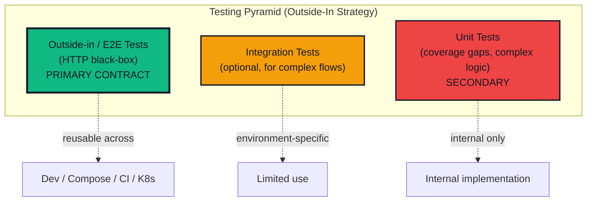
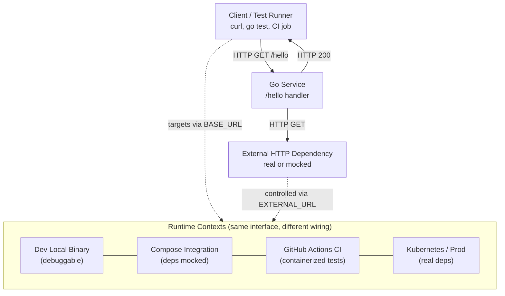
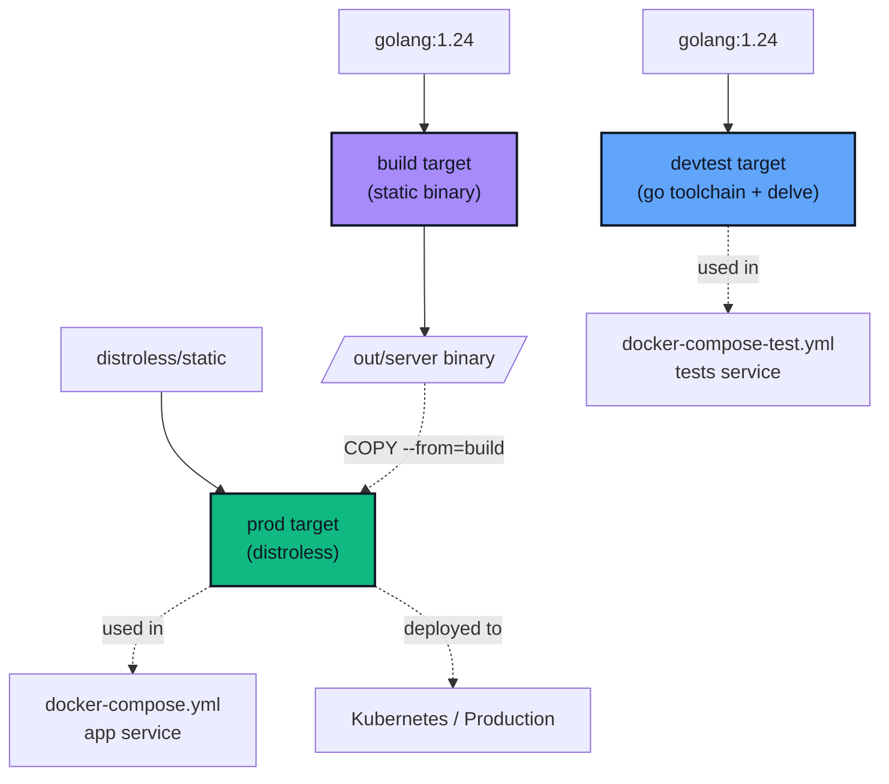
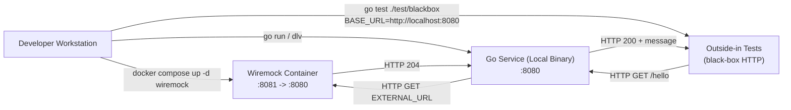

# Architecture Diagrams

This document visualizes the **outside-in testing strategy** across the main runtime contexts (local dev, Docker Compose integration, CI in GitHub Actions, and Kubernetes/prod).

All Mermaid diagrams below use a consistent high-contrast style and a larger font for readability in both light and dark mode.

---

## 1) Testing philosophy and pyramid

- **Outside-in tests are primary**: They validate the stable HTTP contract and are reusable across all environments.
- **Unit tests are secondary**: Used sparingly for coverage gaps and complex internal logic, not for trivial glue code.
- **Integration tests are minimal**: Only when outside-in tests can't adequately cover a scenario.
- **Test portability is critical**: The same test suite runs locally, in CI, and post-deploy with only configuration changes.

## 2) Runtime contexts overview (outside-in first)

- The only stable contract is the HTTP interface (GET /hello), which is what outside-in tests target.
- Test reuse is enabled by using BASE_URL to point tests at different environments.
- Dependency wiring is controlled via EXTERNAL_URL (e.g., Wiremock in integration; real endpoints in K8s/prod).

## 3) Dockerfile multi-stage build targets

- **devtest target**: Contains Go toolchain and optional debugger (dlv), used for running tests in containers.
- **build target**: Intermediate stage that compiles a static binary with trimmed paths.
- **prod target**: Minimal distroless image (~25MB) with only the binary, suitable for production deployment.
- **Separation of concerns**: Test tooling never enters production images, maintaining security and size efficiency.

## 4) Local development (best debugging workflow)

- Dependencies run in Docker, but the service runs locally, enabling step-through debugging.
- The outside-in tests remain pure HTTP and do not import internal DTOs/models.
